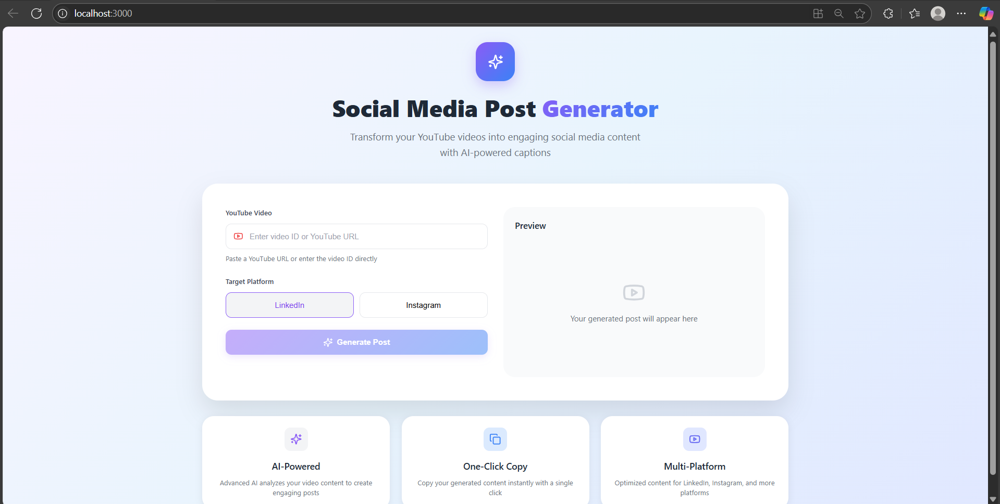

# 🎯 AI-Powered Social Media Post Generator

Transform YouTube videos into engaging social media content tailored for platforms like **LinkedIn** and **Instagram** using AI! This tool extracts insights from videos and creates platform-specific captions with just a video link.

---

## 🚀 Features

- 🎥 Paste a YouTube URL or ID
- 🎯 Choose a target platform: LinkedIn or Instagram
- ✨ Auto-generate a post using AI
- 📋 One-click copy
- ⚡ Built with FastAPI (backend) and React + CSS (frontend)

---

## 🧠 How It Works

1. **Frontend (React)**:
   - User enters a YouTube URL or video ID.
   - Selects a target platform.
   - Clicks “Generate Post”.
   - Sends a POST request to the backend using the `generatePost` API.

2. **Backend (FastAPI)**:
   - Extracts video metadata (e.g., title, description, transcript).
   - Processes content using AI logic (e.g., text summarization, sentiment analysis, keyword detection).
   - Returns a polished social media post to the frontend.

---

## 🛠️ Tech Stack

### Frontend:
- React
- Tailwind CSS
- TypeScript
- Lucide React Icons

### Backend:
- FastAPI
- Python
- Pydantic
- Uvicorn

---

## 📦 Project Structure

agentic-social-media-ai/
├── backend/
│ ├── app/
│ │ ├── main.py # FastAPI app entry point
│ │ └── post_generator.py# AI post logic
│ └── requirements.txt
├── frontend/
│ ├── src/
│ │ ├── components/
│ │ │ └── GeneratorForm.tsx
│ │ └── services/
│ │ └── api.ts # Axios API calls
│ └── tailwind.config.js
└── README.md

yaml
Copy
Edit

---

## 🧑‍💻 Setup Instructions

### ✅ Prerequisites

- Node.js >= 16
- Python >= 3.8
- pip

---

### 🔧 Backend Setup (FastAPI)

```bash
cd backend
python -m venv venv
source venv/bin/activate  # or .\venv\Scripts\activate on Windows
pip install -r requirements.txt

# Run FastAPI server
uvicorn app.main:app --reload

# Frontend Setup (React + Tailwind)
cd frontend
npm install
npm run dev
```


